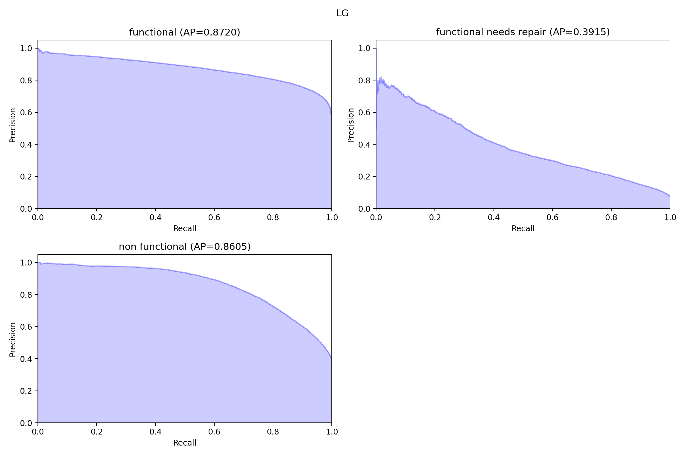
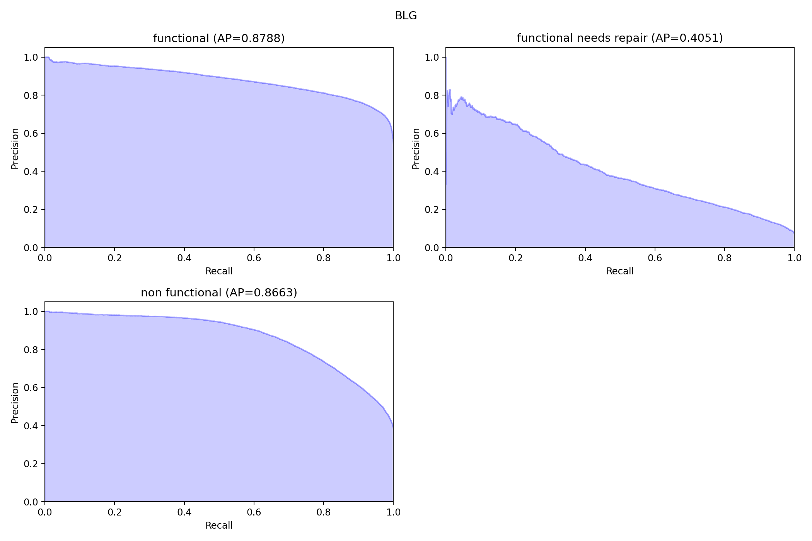
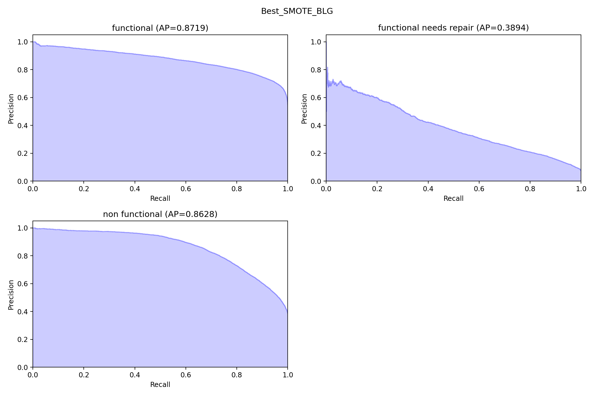

# PumpItUp

Table of Contents

* [***Project Overview:***](#project-overview)

* [***Visualisations using Stills:***](#visualisations-using-stills) 

* [***Visualisations using Tableau:***](#visualisations-using-tableau)

* [***Conclusion:***](#conclusion)

## Project Overview
I have been hired by a humanitarian organization to create a predicative model for the condition of water wells in Tanzania within one week.  

# Dataset Description

Data Sets can be found [here](https://www.drivendata.org/competitions/7/pump-it-up-data-mining-the-water-table/data/).
The feature descriptions are listed [here](https://www.drivendata.org/competitions/7/pump-it-up-data-mining-the-water-table/page/25/)  

You can see the process I took in cleaning the dataset [here](https://github.com/irwin-lam/PumpItUp/blob/main/EDA.ipynb).

## Visualisations Using stills
Model 1: Logistic Regression with default hyperparamaters  

Precision vs Recall Graphs for each class
  

Model 2: Logistic Regression with tuned hyperparamaters  

Precision vs Recall Graphs for each class

Model 3: Smote with default hyperparameters and Logistic Regression with tuned hyperparamaters

Precision vs Recall Graphs for each class

Model 4: Smote with tuned hyperparameters and Logistic Regression with tuned hyperparamaters

Precision vs Recall Graphs for each class

## Visualisations Using Tableau
[Tableau](https://public.tableau.com/app/profile/irwin.lam/viz/PumpItUp_16964904251640/Dashboard1)

## Conclusion
Looking at the visualizations, we can see in the precision vs recall graphs that every model did not perform very well on the class 'functional needs repair'. If you look at the summary section of this [notebook](https://github.com/irwin-lam/PumpItUp/blob/main/Modeling-v2.ipynb), you can see the precision, recall, and f1 score for each model and class. I determined that having a high recall for 'functional' class is in the best interest for the organization. I would want to minimize the amount of visits to these wells because that would be extra expenses and time spent. 

Therefore, I can recommend using a Logistic Regression Model with Tuned Hyperparameters (C = 0.5, tol = 0.001, max_iters = 750, solver = lbfgs).  

Next steps, I would recommend making this dataset into a binary classification with functional being 1 and ('non-functional' and 'functional needs repair') 0s. This will help the model avoid inaccurries it has with predicting the 'functional needs repair' class. Another recommendation would be using more advanced predicative models such as Random Forest or Gradient Boosting.

### Link to the Presentation:
[Google Slides](https://docs.google.com/presentation/d/1ahhkCKOq3yPqH6EHN15eDjpK3-O0AnnKUghERZ5cSBk/edit?usp=sharing)

## Contributer
Irwin Lam   
